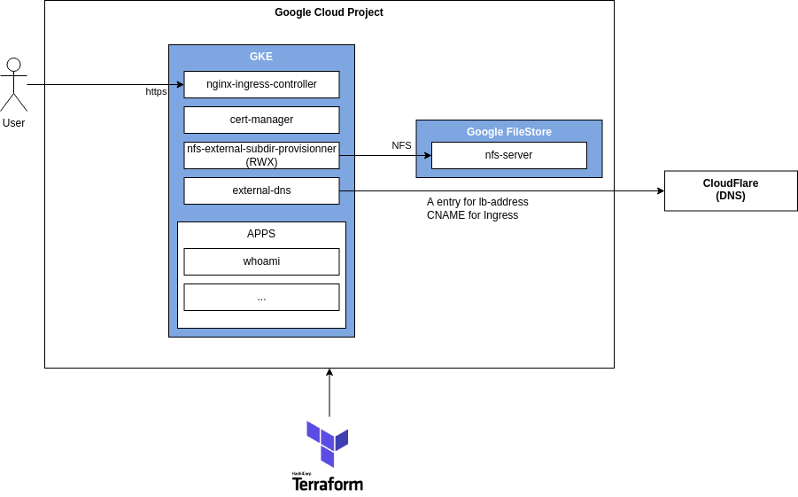

# gke-playground

Expérimentation avec Terraform pour création d'un environnement de développement Kubernetes dans Google Cloud :



## Mise en garde

* Testé uniquement avec des bac à sable Google Cloud de [acloud.guru](https://learn.acloud.guru/).
* Le stockage de l'état Terraform n'est pas traité (voir [backend GCS](https://developer.hashicorp.com/terraform/language/settings/backends/gcs))
* La segmentation réseau (VPC) n'est pas traitée.
* Les sauvegardes ne sont pas traitées.

## Principe du déploiement

Le déploiement est réalisé en plusieurs étapes :

* [01-gke](01-gke) : Création du cluster Kubernetes et la production d'un fichier `gke-playground/output/kubeconfig.yml`
* [02-rwx](02-rwx) : Création d'une instance Google FileStore ("nfs-server") et de la classe de stockage RWX associée ("nfs-legacy")
* [03-lb](03-rwx) : Déploiement de [Traefik](https://doc.traefik.io/traefik/) avec une IP réservée ("lb-address") et de [cert-manager](https://cert-manager.io/)
* [04-dns](04-dns) : Configuration du DNS CloudFlare (résolution de `*.gke.{domain}` sur l'IP réservée "{lb-address}")

## Pré-requis

* Installer [gcloud](https://cloud.google.com/sdk/docs/install) (`gcloud --help`)
* Installer [terraform](https://developer.hashicorp.com/terraform/downloads) (`terraform version`)
* Se connecter sur un compte Google Cloud sur la console : https://console.cloud.google.com/
* Se connecter avec gcloud :

```bash
gcloud auth login
gcloud auth application-default login
```

## Déployer l'environnement de développement

Voir script [install.sh](install.sh) qui assure :

* Le contrôle de la variable d'environnement `PROJECT_ID`
* Le contrôle de l'accès au projet Google Cloud correspondant
* L'activation des services Google Cloud utilisés
* L'appel de `terraform apply -auto-approve` sur chacun des dossiers

A l'usage :

```bash
# Pour install.sh :
export PROJECT_ID=playground-s-11-946429c5
# Pour utilisation direct de terraform :
export TF_VAR_project_id=$PROJECT_ID

# Pour activer 04-dns :
#export GKE_PLAYGROUND_DOMAIN=your-domain.net
#export CLOUDFLARE_EMAIL=...
#export CLOUDFLARE_API_KEY=...

# Création de l'infrastructure avec terraform
bash install.sh
```

Remarques :

* Les paramètres disponibles au niveau des modules terraform sont définis dans le fichiers "variables.tf"
* Noter que `PROJECT_ID` est traduite en `TF_VAR_project_id` et que ce principe peut être utilisé pour d'autres variables (voir [developer.hashicorp.com - Terraform - Input Variables](https://developer.hashicorp.com/terraform/language/values/variables))

## Utiliser l'environnement de développement

Avec une utilisation classique de Google Cloud :

```bash
gcloud config set project $PROJECT_ID

gcloud container clusters list
gcloud compute addresses list

# Pour configurer kubectl (~/.kube/config)
ZONE=$(gcloud container clusters describe primary --format="value(location)")
gcloud container clusters get-credentials primary --zone=$ZONE

# Pour tester le fonctionnement :
kubectl cluster-info
kubectl get nodes
kubectl get namespaces
```

## License

[MIT](LICENSE)

