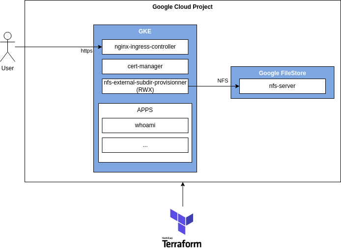

# gke-playground

Expérimentation avec Terraform pour création d'un environnement de développement Kubernetes dans Google Cloud :



## Mise en garde

* Testé uniquement avec des bac à sable Google Cloud de [acloud.guru](https://learn.acloud.guru/).
* Le stockage de l'état Terraform n'est pas traité (voir [backend GCS](https://developer.hashicorp.com/terraform/language/settings/backends/gcs))
* La segmentation réseau (VPC) n'est pas traitée.
* Les sauvegardes ne sont pas traitées.

## Pré-requis

* Installer [gcloud](https://cloud.google.com/sdk/docs/install) (`gcloud --help`)
* Installer [terraform](https://developer.hashicorp.com/terraform/downloads) (`terraform version`)
* Se connecter sur un compte Google Cloud sur la console : https://console.cloud.google.com/
* Se connecter avec gcloud :

```bash
gcloud auth login
gcloud auth application-default login
```

## Principe du déploiement

Le déploiement est réalisé en plusieurs étapes :

* [01-gke](01-gke) : Création du cluster Kubernetes et la production d'un fichier `gke-playground/output/kubeconfig.yml`
* [02-rwx](02-rwx) : Création d'une instance Google FileStore ("nfs-server") et de la classe de stockage RWX associée ("nfs-legacy")
* [03-lb](03-rwx) : Déploiement de [Traefik](https://doc.traefik.io/traefik/) avec une IP réservée ("lb-address") et de [cert-manager](https://cert-manager.io/)
* [04-dns](04-dns) : Configuration du DNS CloudFlare (résolution de `*.gke.{domain}` sur l'IP réservée "{lb-address}")

## Déployer l'environnement de développement

Voir script [install.sh](install.sh) qui assure l'appel de `terraform apply -auto-approve` sur chacun des dossiers avec contrôle et passage des paramètres :

```bash
# Avec un projet acloudguru
export PROJECT_ID=playground-s-11-946429c5
# Création de l'infrastructure avec terraform
# (NB : PROJECT_ID sera traduit en TF_VAR_project_id)
bash install.sh
```

## Utiliser l'environnement de développement

```bash
# Pour inspecter le résultat en ligne de commande :
gcloud container clusters list --project=$PROJECT_ID
gcloud compute addresses list --project=$PROJECT_ID

# Pour configurer kubectl
ZONE=$(gcloud container clusters describe gke-cluster-primary --project=$PROJECT_ID --format="value(location)")
gcloud container clusters get-credentials gke-cluster-primary --project=$PROJECT_ID --zone=$ZONE

# Pour tester le fonctionnement :
kubectl cluster-info
kubectl get nodes
kubectl get namespaces
```


## License

[MIT](LICENSE)

